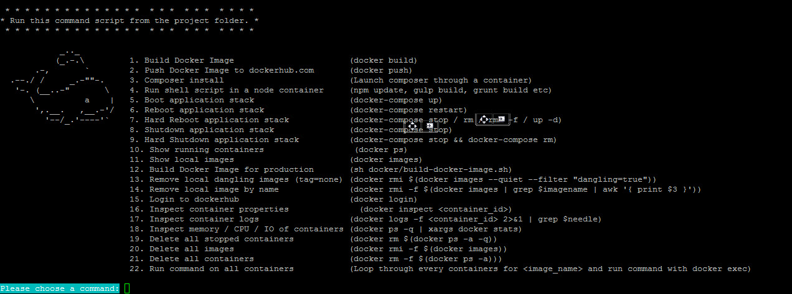

# Docker Commands

Project was built to simplify the Docker learning curve for a dev or an IT team dev to docker usage.
Just symlink the shell script to your /usr/local/bin and you should be able to use it from any project directory.

    ln -sfn docker-commands.sh /usr/local/bin/docker-commands.sh

The shell script build-docker-image.sh can be copied in any of your project in a docker a folder, this one will help
automate build, tag, and push to your repository with interactive prompt. You can execute it directly with
sh build-docker-image.sh or simply execute from the docker command #10

# Contributors
  - Yoanis Gil for the build-docker-image.sh shell script. https://github.com/yoanisgil
  - Crakmedia http://www.crakmedia.com/

